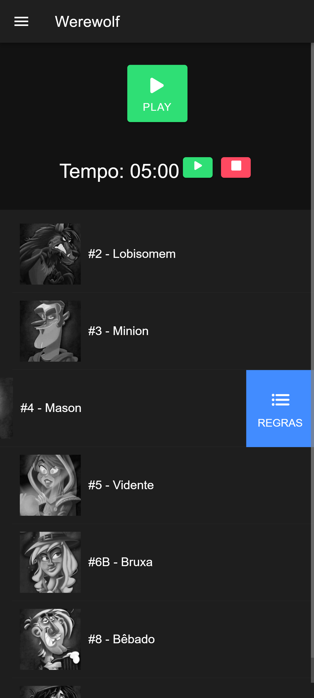
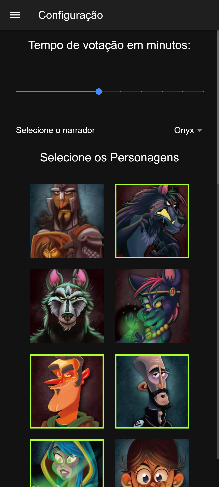
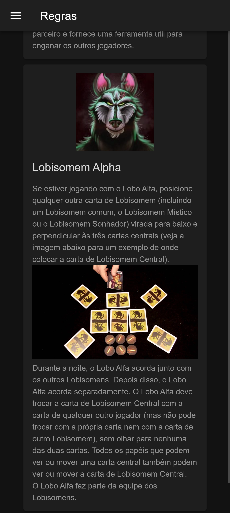

# 🐺🧛 Narrador para One Night Ultimate Werewolf & Vampire

Aplicativo web para narração automatizada em português (pt-BR) dos jogos
One Night Ultimate Werewolf e
One Night Ultimate Vampire.

Ideal para facilitar partidas sem a necessidade de um narrador humano 🎙️

🔗 Acesse o app:
👉 https://danielbergmorais.github.io/werewolf-alpha

## 📸 Preview
<table>
  <tr>
    <td align="center">
       
      Tela inicial de narração do jogo
    </td>
    <td align="center">
       
      Seleção de personagens
    </td>
    <td align="center">
       
      Página de regras
    </td>
  </tr>
</table>

## ✨ Funcionalidades

#### 🎭 Seleção de Personagens

- Escolha quais personagens estarão na partida
- Suporte a personagens de Werewolf e Vampire combinados
- Configuração flexível para diferentes estilos de jogo
- Áudios em português brasileiro
- Orientações claras para cada personagem durante a noite
- Substitui a necessidade de um narrador humano

#### 📖 Página de Regras
- Explicação das regras básicas
- Descrição das funções dos personagens
- Ideal para novos jogadores
- Cronômetro para a fase de discussão
- Ajuda a manter o ritmo da partida

## 🎯 Objetivo

O projeto foi criado para:

- Facilitar partidas de One Night Ultimate
- Tornar o jogo mais acessível em português
- Automatizar a narração e organização da partida

## 📌 Melhorias futuras
 - Mais vozes de narração
 - Aplicativo disponivel para Android
 - Adicionar os personagens complicados do jogo (Doppelganger, Copycat)

## 📄 Licença

Projeto para fins de uso pessoal.